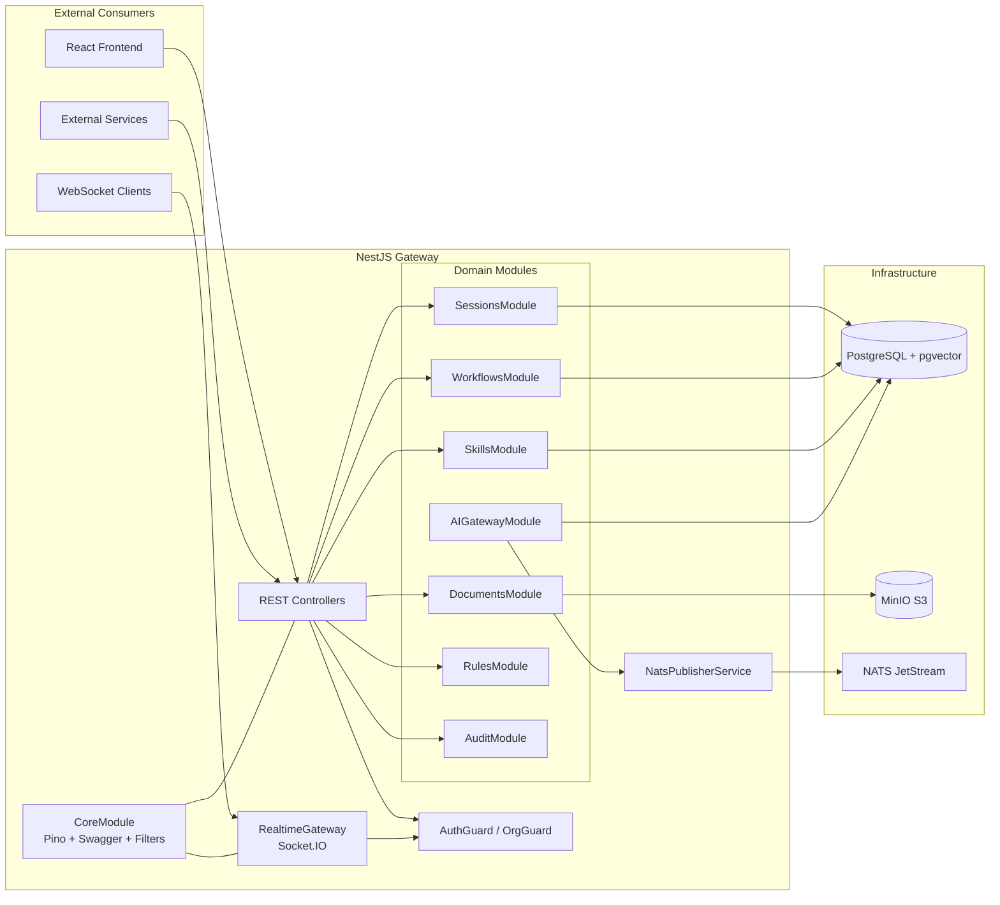
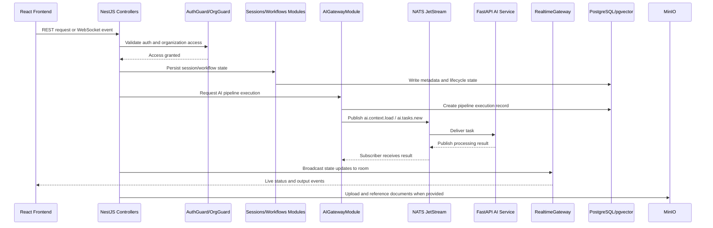
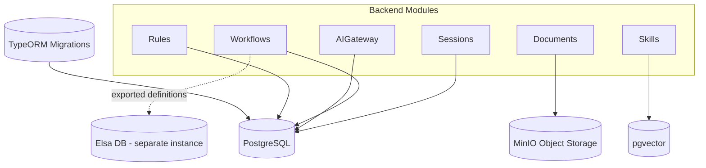

# FlowForge Backend

NestJS gateway and local development infrastructure for FlowForge.

## NestJS Gateway Documentation

### 1. Overview

The NestJS Gateway is the orchestration core of FlowForge. It exposes REST and WebSocket interfaces to clients, enforces multi-tenant access boundaries, coordinates domain modules, and delegates AI processing to the FastAPI service through NATS JetStream.

In architectural terms, this backend is a modular monolith: infrastructure concerns are centralized, while business capabilities are organized into focused modules.

### 2. System Architecture



### 3. Global Infrastructure

The gateway applies shared, cross-cutting controls across all modules:

- Observability: structured logging via Pino and dependency-oriented health checks
- Security: multi-tenancy guardrails through Org and auth controls
- API Docs: Swagger/OpenAPI at `/api/docs`
- Realtime: room-based Socket.IO updates through `RealtimeGateway`

### 4. Domain Modules

| Domain Area | Responsibility | Key Components |
|---|---|---|
| Session and workflow lifecycle | Manages the elicitation finite-state machine and version transitions | `SessionStatus`, `session-fsm.ts` |
| AI gateway and execution | Creates pipeline execution records, publishes tasks, and consumes AI results | `AIGatewayService`, `AIGatewaySubscriberService` |
| Documents, skills, and rules | Ingestion, reusable AI behavior libraries, and org-specific constraints | `DocumentsModule`, `SkillsModule`, `RulesModule` |
| Realtime and messaging | Emits live events to clients and orchestrates async communication | `RealtimeGateway`, `NatsPublisherService` |
| Persistence and schema | Relational and vector storage with migrations | TypeORM, PostgreSQL, pgvector |

### 5. Backend Processing Flow



### 6. Messaging and Async Contracts

The gateway uses NATS JetStream to decouple client interactions from AI execution and to provide resilient asynchronous processing.

Known backend subjects from the documented flow:

- `ai.context.load`
- `ai.tasks.new`

This pattern allows the gateway to persist intent immediately, dispatch jobs asynchronously, and stream progress back to active client rooms.

### 7. Persistence Model

The backend persistence layer uses PostgreSQL with pgvector for semantic features and TypeORM for schema management.



### 8. Health Monitoring

The gateway exposes service-level health checks that verify the status of key dependencies:

| Endpoint | Purpose |
|---|---|
| `/api/health/ai-service` | Verifies FastAPI worker availability |
| `/api/health/ollama` | Verifies local LLM provider availability |
| `/api/health/pgvector` | Verifies vector database connectivity |
| `/api/health/nats` | Verifies JetStream connectivity and stream status |

### 9. Operational Role in the Platform

The NestJS backend is the control plane between UI and AI execution. It does not perform heavy language inference itself. Instead, it enforces access, stores canonical state, triggers asynchronous AI work, and distributes realtime updates.

## Local Execution

### Quick Start

```bash
pnpm install
cp .env.example .env
docker compose up -d app-db elsa-db nats minio ollama
docker compose up --abort-on-container-exit --exit-code-from nats-init nats-init
docker compose up --abort-on-container-exit --exit-code-from minio-init minio-init
pnpm migration:run
pnpm start:dev
```

Health endpoint:

- `http://localhost:3000/api/health/ping`

### Useful Commands

Build, lint, and tests:

```bash
pnpm build
pnpm lint
pnpm test
```

Run smoke checks:

```bash
./scripts/smoke.sh
SMOKE_PULL_MODELS=1 ./scripts/smoke.sh
```

### Docker Compose Services

- `app-db`: PostgreSQL 16 with `pgvector`, `pgcrypto`, and `citext`
- `elsa-db`: PostgreSQL 16 for Elsa
- `nats`: NATS 2.10 with JetStream and monitor port `8222`
- `nats-init`: creates the `FLOWFORGE` stream
- `minio`: private object storage
- `minio-init`: creates private `documents` and `exports` buckets
- `ollama`: local model server with persistent model volume
- `ollama-init`: pulls `mistral:7b-instruct` and `nomic-embed-text`
- `nestjs`: this backend Dockerfile
- `fastapi` and `nextjs`: lightweight placeholders by default

When real FastAPI and frontend services are present, override contexts in `.env`:

```bash
NESTJS_CONTEXT=./backend
FASTAPI_CONTEXT=./ai-service
NEXTJS_CONTEXT=./frontend
```

### Reset Data

Stop containers and keep volumes:

```bash
docker compose down
```

Stop containers and remove volumes:

```bash
docker compose down -v
```

